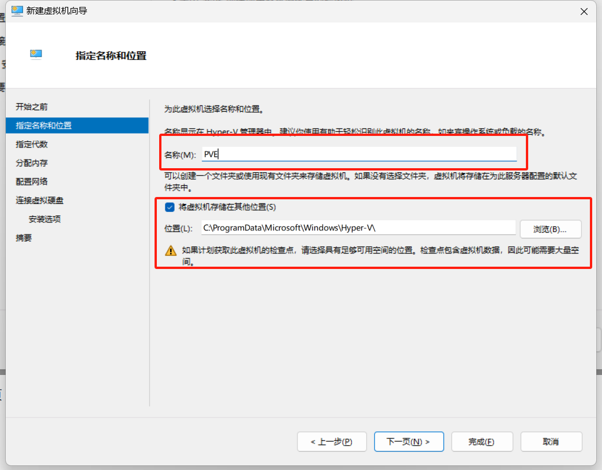
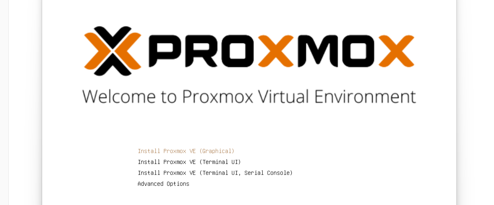
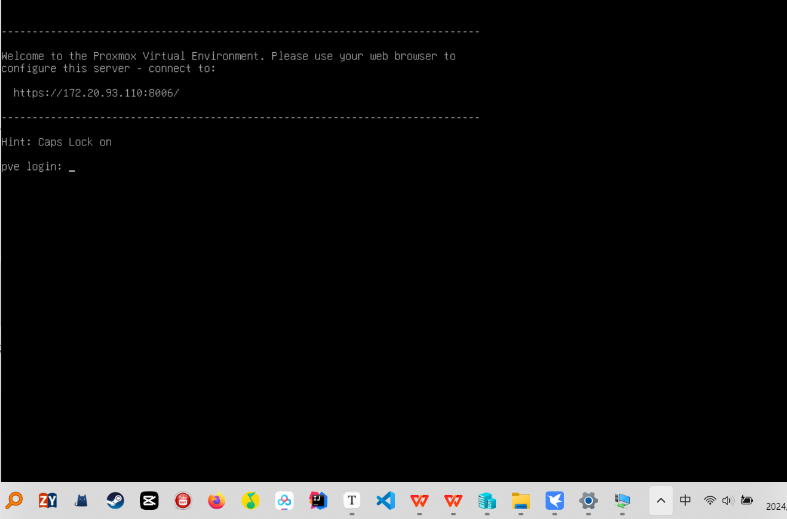
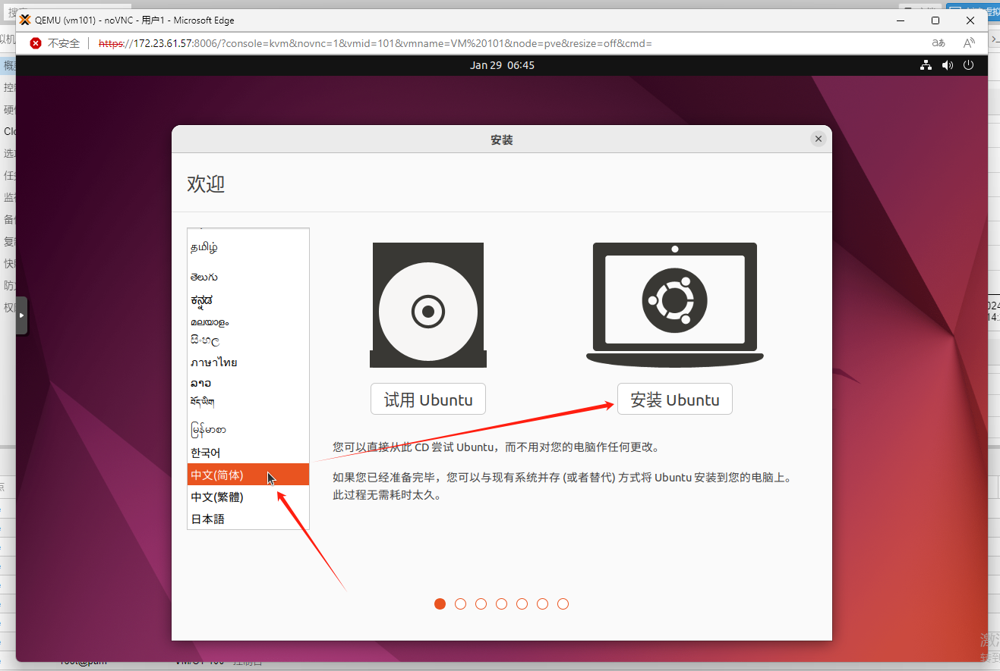
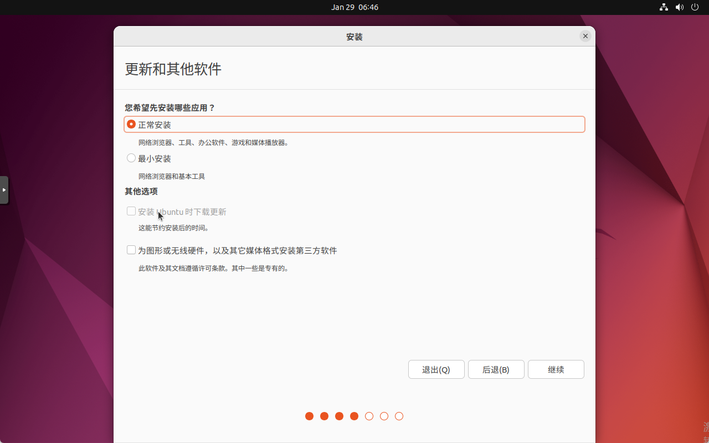

# 从零开始

# 一、架构图


注：上图为此次构建知识图谱的架构图，我们只用一台win11系统的电脑来完成上述的架构。流程为在win11上安装hyper-v，这是一个虚拟机管理系统，打开hyper-v的虚拟嵌套功能，再在hyper-v上安装pve，pve也是一个虚拟机管理系统，再在pve上安装neo4j，然后再在neo4j上建立我们的图数据库。

# 二、Hyper-v

### 2.1 在win上安装hyper-v

hyper-v是win系统自带的虚拟机管理器，我们可以直接打开，流程如下：

控制面板 --> 程序和功能 --> 启动或关闭Windows功能 --> Hyper-V（选中即可，确保两个勾都打上了）

***如果没有Hyper-v这个选项看2.2小节来解决这个问题***


### 2.2  解决没有hyper-v选项问题

新建一个文本文档，将下述代码复制到文档里面，再将文件后缀由 txt 改为 bat，双击运行即可，重启电脑即可解决问题。

```python
pushd "%~dp0"

dir /b %SystemRoot%\servicing\Packages\*Hyper-V*.mum >hyper-v.txt

for /f %%i in ('findstr /i . hyper-v.txt 2^>nul') do dism /online /norestart /add-package:"%SystemRoot%\servicing\Packages\%%i"

del hyper-v.txt

Dism /online /enable-feature /featurename:Microsoft-Hyper-V-All /LimitAccess /ALL
```

弄好的文件如下图所示，双击运行即可。


### 2.3 启动hyper-v以及配置交换机

在搜索栏中输入hyper-v即可找到hyper-v管理器，打开即可


打开之后，界面如下。中间第一行是你创建的虚拟机列表，因为是第一次进来，什么都没有。


右键我们的用户名，即可新建虚拟机。


在创建虚拟机之前，我们需要建立一个虚拟交换机，让虚拟机和物理机处在同一个局域网里面。找到虚拟交换机管理器。


创建新的虚拟交换机，选择外部网络，然后创建。


名称起一个为lan，选择自己网卡，要选择现在电脑所连接的网卡，如果不知道自己的电脑现在连接的什么网卡，看下一步。


我们查看一下现在电脑用的什么网卡在联网。如果你连接的wifi就去WLAN找，如果插得网线就去以太网找。


wifi的话，点开之后，再点wifi属性，往下滑就能找到制造商，那么我们创建虚拟交换机的时候就选择这个就行


如果是插的网线就去以太网中找，同理，创建虚拟交换机的时候选这个就行


这样我们的虚拟交换机就建立好了，除了默认网络还有一个我们刚才建立的lan


### 2.4 创建虚拟机

创建新的虚拟机，第一页直接下一步


第二页可以更改两个东西，第一个是名称，第二是存放位置



第三页我们选择第一代


第四页分配内存，看你的需求，可以默认，可以大一点（4096MB=4G）


第五页我们选择刚创建的lan


第六页直接下一步


第七页 选择以后安装操作系统


最后一页直接点击完成


这样我们的创建虚拟机步骤就完成了，下一章节我们开始配置pve相关事项


### 2.5 开启hyper-v嵌套虚拟化

我们需要开启hyper-v的嵌套虚拟化功能才能正常安装pve

我们用管理员身份打开PowerShell或者PowerShell ISE，这里我打开后者，因为有输入命令的时候可以自动补全，其实都一样。


第一步，我们首先输入命令 

```powershell
Get-VM
```

得到我们的虚拟机列表


第二步，我们输入命令（注：后面两个参数PVE是我们的虚拟机名称，你如果不是，请修改；最后的参数是两个英文字母f和l，并不是数字1）

```powershell
 Get-VMProcessor -VMName PVE | fl
```

得到如下信息，红框内便是嵌套虚拟化功能，可以看到是关闭状态。


第三步，输入命令打开嵌套虚拟化功能（注：最后参数 PVE 酌情修改）

```powershell
Set-VMProcessor -ExposeVirtualizationExtensions $true -VMName PVE
```

再输入命令

```powershell
 Get-VMProcessor -VMName PVE | fl
```

查看一下,此时嵌套虚拟化功能已经打开


# 三、PVE

### 3.1 下载pve

> [下载连接](https://enterprise.proxmox.com/iso/)


点击你想要的版本进行下载，我下的是8.1版本的

### 3.2 配置pve

第一步，打开pve的设置


第二步，双击网络适配器，点击高级功能，打开 ***启用MAC地址欺骗*** 选项，应用即可。


第三步，修改处理器的数量为8个，看你的机器配置，一般8个就行，记得应用


第四步，再IDE控制器中将刚下载的pve映像文件添加进去，再应用一下，就可以了


### 3.3启动pve

双击我们的pve启动


点击启动


回车安装



直接同意，进入下一步


继续下一步


国家选择China，时区选择上海


设置一个密码，邮箱没啥用，可以设置成和我一样


这里要详细说一下，

第一个框hostname可以设置成我们刚才的邮箱名字

第二个框IP Address要设置成自己局域网的同主路同网段，别和下面的冲突，比如我的局域网地址是172.20.93.112，那这个框我就设置成172.20.93.110，110可以随便改，范围再1-255

第三个框Gateway是自己的局域网地址，不知道局域网地址的还是和上面查找网卡产品商的步骤一样，在同一个页面就能找到。

第四个框DNS 设置成和局域网地址一样就可以


这里记住取消自动重启，因为还要配置一些东西。然后安装就行。


安装完毕之后，直接叉掉


然后强制关闭虚拟机


再打开设置，删除刚才的DVD驱动器，删除后如下图


点击BIOS，将IDE上移，启动项改为IDE第一位，记得应用


然后我们再去双击启动pve，一直等待出现如下界面，便是安装成功。



我们打开浏览器输入界面中的地址 https://172.20.93.110:8006 进入pve管理后台，是https不要忘掉s。

之后会提示不安全连接，点击高级，继续访问即可


进来后输入用户名，默认是root，密码是刚才自己设置的密码，语言选择中文简体


然后会提示无效订阅，不用管，直接确定就行，这个不影响任何功能的使用


至此我们的pve就已经配置完毕。

# 四、 Ubuntu

### 4.1 下载Ubuntu

版本为22.04.0-desktop-amd64

地址：[ubuntu-releases-22.04安装包下载_开源镜像站-阿里云 (aliyun.com)](https://mirrors.aliyun.com/ubuntu-releases/22.04/)


### 4.2 在pve上安装Ubuntu

第一步先上传Ubuntu镜像


第二步在pve上创建虚拟机


名字可以按照我的起：ubuntu加版本号，我先前创建好一个（VM ID为100那个）了，然后下一步


第三步是选择我们的镜像文件


第四步 都默认


第五步 总线选择SATA


第六步 类别选择host，核心数自己看自己的机器，一般4或者8都可以


第七步 内存搞到4G


第八步 网络模型我们选择intel E100 然后确认就行


### 4.3 启动并配置Ubuntu

第一步 点击我们刚才创建好的虚拟机进入ubuntu图形化页面（正常情况下名字是我们刚才设置的ubuntu2204，由于我之前设置了一个一样的，冲突了，他自己给我改成VM 101了，可能pve系统检测到名字冲突时，会自动将VM ID设置为名字）


第二步 进到图形化页面，选择中文然后安装Ubuntu



第三步 选择中文键盘布局


第四步 选择正常安装



第五步 如图 默认就好，然后选择现在安装就行


然后关机，回到pve界面，双击红框位置


选择不适用任何介质


结果如下图


为什么要这样做？

> 安装完成后，如果不删除或断开这个虚拟的CD/DVD驱动器，每次虚拟机启动时都会首先检查这个驱动器，看它是否含有启动信息。如果虚拟CD/DVD驱动器仍然挂载着ISO文件，系统可能会再次从这个ISO启动，导致你看到的是安装程序启动画面，而不是你刚安装好的操作系统。这显然不是我们希望的结果。
>
> 因此，安装完毕后推荐删除或断开CD/DVD驱动器（即卸载ISO文件），确保下次启动时，虚拟机能够从其硬盘启动，加载你刚刚安装的操作系统。在Proxmox VE中，这通常意味着要在虚拟机的配置设置中去除ISO镜像文件的引用。

至此我们的Ubuntu安装完毕
