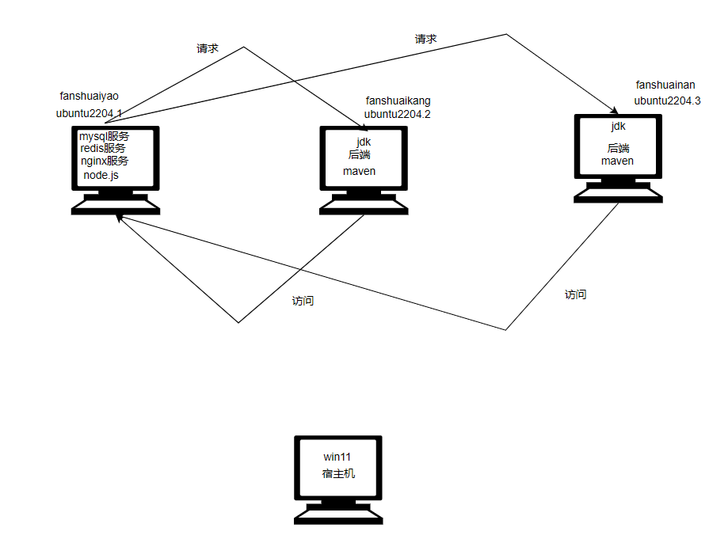
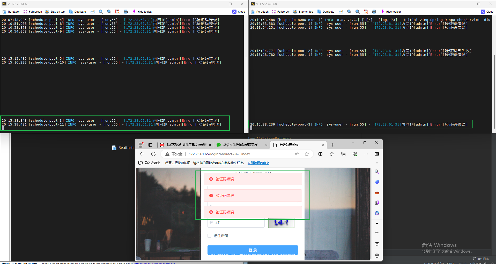
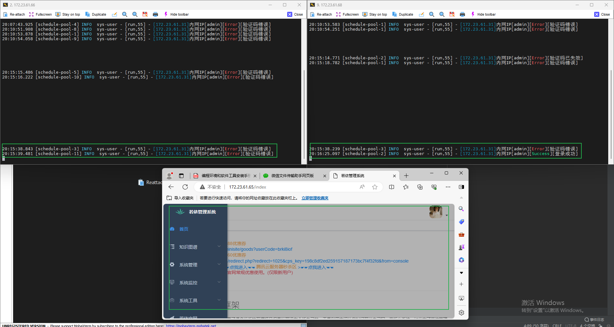

# 整体架构图



宿主机：win11

虚拟机管理器：hyper-v

虚拟机：三台同网段的ubuntu2204


# 流程

## 第一步 开启hyper-v

略

## 第二步 下载Ubuntu

略

## 第三步 配置Ubuntu

参考配置pve，略

## 第四步 为三台Ubuntu配环境

所要求的环境，上图中已经表明，各个环境版本如下

```xml
mysql:  版本：5.7.30      mysql-5.7.30-linux-glibc2.12-x86_64.tar.gz
jdk:    版本：1.8.0_152   jdk-8u152-linux-x64.tar.gz
maven:  版本：3.8.2       apache-maven-3.8.2-bin.tar.gz
redis:  版本：5.0.8       redis-5.0.8.tar.gz
node:   版本：14.16.0     node-v14.16.0-linux-x64.tar.gz
nginx:  版本：1.17.10     nginx-1.17.10.tar.gz
```

## 第五步 部署前端项目

* 配置nginx代理

* 打包前端代码

## 第六步 部署后端项目

* 配置mysql和redis和neo4j
* 打包后端代码

# 效果

我们对两台虚拟机进行日志追踪，可以发现我们提交三次的请求有两次去请求172.23.61.66这台机子（左边）一次请求172.23.61.68（右边）这台机子。



登录成功请求，请求到右边的机子



# 遇到的问题

* 新建的虚拟机想要远程连接先安装openssh    **sudo apt install openssh-server**
* 如果远程连接登录的时候出现  **Access denied**   需要修改配置文件 /etc/ssh/sshd_config：找到*PermitRootLogin without-password*  将 without-password改为 yes即可，之后保存，**service ssh restart**重启服务即可
* 从远程向某文件夹中上传文件，权限不够：在上一级目录中 执行   **chmod777 文件名**
* 
